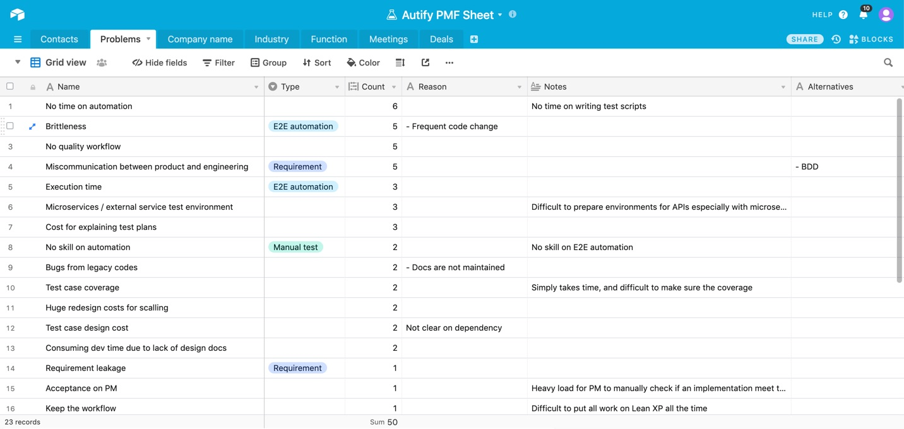

こんにちは、[@chikathreesix](https://twitter.com/chikathreesix)です。元々エンジニアで、今は[Autify](https://autify.com)というAIを用いたソフトウェアテストの自動化製品を開発するスタートアップのCEOをやっています。

この記事では、BtoBスタートアップがProduct Market Fitするために必須である「顧客のBurning needsを解決する」ことについてアメリカのアクセラレーターAlchemist Acceleratorにて学んだ経験を元に書きました。

僕らがどのように顧客のBurning needsを見つけ、Autifyという製品にたどり着いたのか、その過程と失敗について共有することで、エンジニア起業家やBtoB SaaS起業家の方々の参考となれば幸いです。

※BtoCには当てはまらないケースもあるかもしれませんが、僕はBtoCの事は全くわからないのでご容赦ください。

------

弊社は2019年の1月にアメリカのトップスタートアップアクセラレーター、[Alchemist Accelerator を日本人で初めて卒業し](https://thebridge.jp/2019/02/japaneseenterpreneur-ai-softwaretest-autify-alchemistaccelerator)、2019年10月に[$2.5Mのシードラウンドの調達を終え](https://jp.techcrunch.com/2019/10/02/autify-fund-raising/)、現在社員は続々と増え、導入社数も右肩上がりで増えています。一見順風満帆ですが、実は会社を設立してからAutifyに至るまでの2年間は、ピボットを何度も繰り返し、鳴かず飛ばずの地獄そのものでした。

そんな僕らを地獄の底から這い上がらせてくれたのがAlchemist Acceleratorのプログラムだったのですが、その中で特に大きく僕らの行動を変えたアドバイスがありました。それは、**「顧客のBurning needsを解決しろ」**というものでした。

# Burning needsとは

そもそもBurning needsとは何か、初めて耳にする方もいらっしゃるでしょう。

*http://viewfrombehindhomeplate.blogspot.com/2014/01/putting-out-fire.html*

Burning needsとは画像のように頭に火が付いていて、今すぐ消さないとマズイ、というような課題のことです。このような状態に対して、 英語で「頭に火がついている」、 `"hairs on fire"` と実際に表現します。基本的に企業はこのような、**直近の課題の解決にしかお金を払いません**。

BtoBの場合特に、課題解決出来るかどうかをシビアに判断します。こんなのあったらいいよね、というフワッとした製品に払うお金など**一円もないのです**。 

# BtoBで売れる製品とは

ではどういった製品が売れるのか、BtoBで売れる製品は基本的には2種類しかありません。

1. 顧客の利益を上げる製品
2. 顧客のコストを下げる製品

大きい企業になればなるほどROIを気にするので、この2点で説明出来ない製品はなかなか売るのが難しいでしょう。少なくとも僕のようなエンジニアバックグラウンドで営業のプロではない人間には、そのような製品を売る営業テクニックを持ち合わせていません。

ではいつも使っているSlackやAtlassian製品のようなものはどこに当てはまるのでしょうか。

# BtoB SaaSスタートアップのよくある誤解

前田ヒロさんのブログで言及されている [SaaSの死の谷](https://hiromaeda.com/2017/02/05/deathvalley/) というものがあります。端的に言うと、BtoB SaaSの成功は、単価が安い製品をめちゃめちゃ多くの企業に売るか、高い製品をある程度の数の企業に売るかの2パターンしかないわけです。

我々が日常多く目にするのはSlackやAtlassianなど前者の製品なのですが、ここの領域は勝者総取りになりやすい領域で難易度がめちゃめちゃ高い。戦略としてはマーケティング強めで直接営業少なめ、オンボーディングもプロダクト内で行うなど、どちらかというとBtoCの戦略に近い。なので直接的に、コストが下がるとか利益が上がるみたいな話も出て来にくいタイプの製品です。

BtoB SaaSを始める殆どの場合において前者の戦略は上手くいかないことをまず肝に銘じましょう。勝者総取りの世界で、グローバル市場がまともに取れない製品を月額数千円で売って、売り上げが立つわけないのは当たり前です。

# Founderが売れない製品は「売れない」

僕も起業したての頃は、Atlassianなどの製品をイメージしていて、クレカ決済で無料トライアルを仕込んでおいてProductHuntでローンチすれば良いプロダクトは自然に売れるんだ！と思ってましたが、**多くの場合においてそれはただの幻想**です。

良いプロダクトを作れば勝手に売れる、いい曲作れば売れると言っている売れないバンドマンと同じだと思いませんか？早期にこの誤解を解くことから始めるべきです。こんなのあったら便利だなと作ったものが瞬く間に売れて成功する、**ソーシャルネットワークの映画のような世界があなたに訪れることはまずあり得ません。**

Alchemistにもよく、「Founderが売れないものは売れない。Founderが自ら売りに行け」と言われました。これまで僕は「自分はエンジニアだから営業は得意じゃない、製品が上手くいったらいずれその道のプロに入ってもらえば良いんだ」と考えてました。

しかしAlchemistのプログラムの最初は、ひたすらcold emailを送りアポを取る営業活動から始まります。しかも周りの同期はガンガン売ってて、自分もちゃんと結果を出さないとプログラムを卒業できません。これにより、僕自身、まずは**セールスマンになろう**と意識が変わったのが、間違いなく大きな分岐点となりました。

エンジニアだろうが何だろうが、初期においてはファウンダーが [セールスアニマル](https://www.slideshare.net/takaumada/startup-sales-animal) にならないと、成功は難しいでしょう。

# 顧客と話せ

Autifyに至る前は様々な製品に取り組みましたが、その中での大きな失敗は**最初から製品を作ってしまう**事でした。僕はエンジニアなので、良いアイディアだと思ったら直ぐに作り始める事ができます。しかし実際にはビジネスとして上手くいかない製品に、多くの時間を費やしてしまいました。

おそらくスタートアップが上手くいかないほとんどの理由が、Burning needsの無いところに製品を作り続けている事にあるのではないでしょうか。ですので、作るより前にまず顧客のBurning needsを特定することから始めなければいけません。

Alchemist開始時にはソフトウェアテストに関わる別の製品を開発していました。この製品の営業で多くの会社と話をしましたが、どこの会社も一様に以下のような反応をしました。

> いいですね、完成したら使ってみたいので教えてください

この反応を受けて、このままでは売れないので、もっと開発しなければならないと思いました。しかしこれは完全なる間違いです。このような反応が返ってくる製品は、**顧客のBurning needsを解決していない**可能性が非常に高いです。何故ならば彼らは今すぐ欲しいと思ってないからです。

つまりこの製品は完成しても恐らく売れないでしょう。

# Burning needsの特定方法

Alchemistプログラム6ヶ月中の最初の3ヶ月で60社程に営業活動を行ったものの、ほとんどの会社から上記のような反応を受け非常に焦りました。製品が売れない、このままではプログラムを卒業できない。

製品がBurning needsを解決していないことを理解しましたが、どうしたら良いのか分かりませんでした。しかしふと考えると手元にはこれまで営業してきた60社のヒアリングノートがありました。

*「この中に答えがあるはずだ！」*

そこでヒアリングノートから、顧客が何に困っていたのか課題を抽出し、Airtableの表にまとめて、同じ課題が言及された回数順に並び替えてみました。そうするとほとんどの会社で言及されている共通の課題が見えてきたのです。

**課題をまとめたAirtableの表**

一社一社営業活動をしていると直近のミーティングの印象に引きずられ、偏った見方になってしまっていましたが、表でまとめて俯瞰する事により答えが見えてきました。

そこで見えてきた共通の課題は２つありました。１つ目はテスト自動化エンジニアの人員が確保出来ずに自動化が進まない。２つ目は一度自動化しても、アプリケーションのUIが頻繁に変わるので、自動化スクリプトが直ぐ動かなくなってしまい、メンテナンスに多くの時間を取られるというものでした。

# 製品がない状態で契約を獲得する

驚くことに営業に行った8割以上の会社でこれらの課題が言及されていました。この課題が解決できれば間違いなく大きなビジネスが作れる、そう感じて1から製品を考え直しました。そこで考えた解決策が下記の二点です。

1. テストの操作を記録する仕組みで、エンジニアでなくても簡単に自動化が出来ようにする
2. 手間のかかるメンテナンスをAIが行う

これをベースにプレゼンスライドを作り直し、簡単な紙芝居のデモアプリを作って動画を取りました。ここまで全て一晩で行いました。

そして、これらを持って次の日の顧客アポに行くと、これまでと全く反応が違いました。製品はまだないのにも関わらず、「買います！」となったのです。顧客のBurning needsを見つけ、それに対して適切な課題が当たった状態が達成できると、顧客の反応はこのようになったのです。

なにせ頭の上で火が燃えており、なんとかして早く消さないといけない訳ですから、この反応はもっともです。

# Product Market Fitの基準

スタートアップのよくある疑問として、どういう状態になったらProduct Market Fit(以下PMF)なのか、とよく言われます。僕も最初の2年はずっと疑問でした。PMFとは製品が市場のニーズにフィットした状態のことを指します。

SegmentのFounderのPeter Reinhardtは [こちらの講義](https://www.youtube.com/watch?v=_6pl5GG8RQ4) の中で、**「PMFは達成したら必ず分かるものだ」**と言っています。以前にこの話を聞いた時は、全く理解できなかったのですが、今なら理解できます。なぜなら上記の通り顧客のBurning needsを発見し適切な解決策を提示すると、一気に世界が変わったからです。

まず全くマーケティングしていないのに、有名企業から次々とデモリクエストが来ました。以前のプロダクトでは、デモリクエストは個人メールアドレスばかりだし、終いには大量のエロ画像を送りつけられたりと酷い有様でした。リードの質が圧倒的に変わり、こんなにも世間の反応が違うのかと驚きました。

また、事業を伸ばすために必要なことは全て顧客が教えてくれるようになったのです。

例えば、開発する機能。これまでは「こんな機能があったらもっと使われるんじゃないか」という仮説で開発をしてましたが、今は複数の顧客から同じ要望を受けたら間違いなく必要な機能なので、実装の優先度を上げるという方法を取っています。これまでのような仮説主導の開発は一切なくなり、確実に必要なもののみを開発出来るようになりました。

また、製品の価格。これも率直にどのくらいの価格を想定しているか聞くことで、ハッキリと決められるようになりました。我々の場合はテスターの人件費と比較されるので、人件費と比べてお得に感じてもらえれば確実に売れます。また組織規模によって予算のレンジが大体分かるようになったため、サイズにフィットするようにプランを作ることが出来ました。

さらに採用する職種。これは直接教えてくれる訳ではありせんが、日々の業務から顧客の期待に応えるためにもっと何をするべきなのか、顧客数が増えた時にどこがボトルネックになるか分かるので、それらを埋めてくれる人を前もって採用していけば良いことが分かりました。

# 顧客のBurning needsを解決するということ

今までは例えるならば、登り坂にいてなかなか進まない大きな岩を押していた感覚でした。前が見えない、後ろに下がることもできない、岩も重すぎて動かない。しかし、顧客のBurning needsを特定して、正しい解決策を提示できてからは、いきなり下り坂になり岩が勝手に転がり出して、急いで先回りして方向を調節しないと勝手にどこかに行ってしまうという感覚になりました。

BtoBスタートアップでPMFを模索している方々は是非以下を実践してみてください。

1. 製品の開発をやめて、顧客のBurning needsの特定に全注力する
2. 特定したBurning needsを、これまでより何倍も良い方法で解決する解決策を定義する
3. 解決策のプロダクトアイデアをプレゼン資料に落とし込み、営業活動を行う
4. 開発前から契約を獲得する。複数社当たっても前述の反応をされて契約が獲得できなかったら1に戻る
5. 製品を急ピッチで開発する

そのうち時間ができたら、これらの経験を元にBtoB初期スタートアップがPMFするためのフレームワークをまとめてみたいと思います。

> Burning needsの解決なしに、成功なし

