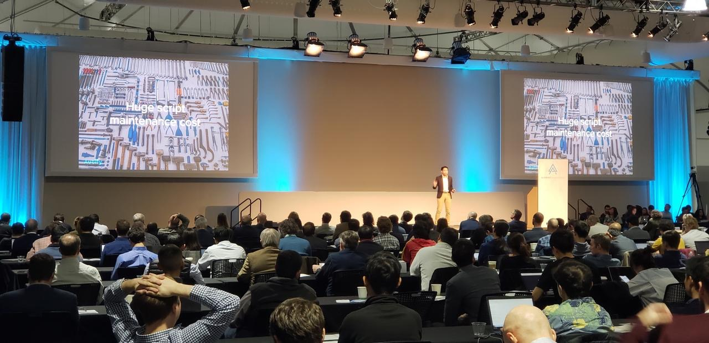

こんにちは、Autify CEOの近澤（[@chikathreesix](https://twitter.com/chikathreesix)）です。2019年があっという間に終わってしまい、2020年になりました。本年もどうぞよろしくお願い致します。年明け一発目の記事は、2019年大きく成長したAutifyの事業について振り返ります。

前回の記事、「[顧客のBurning needsを解決する](/burning-needs)」は、2018年までのプロダクト模索期について書いているため、実際Burning needsを捉えた後どうなったかが今回の記事の内容になります。

# 1月: Alchemist Acceleratorの卒業

[前回の記事](/burning-needs)で書いたように、Autifyの製品にたどり着いたのが2018年11月の頭で、その後1ヶ月集中的に営業を行い、2018年12月までにはいくつか契約がまとまりました。Alchemist AcceleratorのDemo day（全米の投資家を集めた成果発表会）は1月23日だったので、1月頭から急いでピッチの準備を行い、無事デモデイを終えプログラムを卒業することが出来ました。

巨大な会場で全米の投資家400人ほどが会場におり、ストリーミングで全世界から4,000人ほど視聴していたようです。ピッチの動画もあるので是非ご覧ください。

  <iframe src="https://player.vimeo.com/video/313960885" width="100%" height="360" frameborder="0" allow="autoplay; fullscreen" allowfullscreen></iframe>

実はピッチの2日前に、同期のピッチスライドと見比べて、これじゃいかんと思い、夜に全部作り直しました。

結果、反応は非常に良く、ピッチを終えた瞬間から投資家からのミーティングリクエストがひっきりなしに来て携帯が鳴り止みませんでした。

# 3月: Closed beta版のローンチ

2018年12月中にローンチ前にも関わらず受注を頂き、急ピッチで開発を進めて3月1日にClosed beta版のローンチを行いました。

この時の機能は本当に限られていて、現在レコーダーと呼んでいるChrome Extentionもまだなく、ユーザー側からシナリオをAutifyで作成する事ができませんでした。なので、お客様から自動化したいシナリオのリクエストを頂き、弊社側でその自動化テストコードを実装してAutifyにアップロードするという、ある意味受託開発に近い形を取っていました。このような状態でお使い頂いた初期のお客様の皆様には本当に頭が上がりません。

このような形でローンチと開発を進めたことが、事業と製品の成長の観点で非常にうまく進みました。これについてはまた別途まとめます。

Closed beta版のローンチ後は頻繁にお客様の元に出向き、フィードバックを集めました。面白いことに、各社で共通したフィードバックをもらうことがほとんどだったため、多くリクエストをもらった機能で重要度が高いものから順番に開発していく事で、本当に必要なものの開発のみに集中することが出来ました。今でもこれを続けています。

# 7月: $2.5Mのシードラウンドの調達

1月のAlchemistのデモデイ後、ありがたいことに本当に多くの投資家の方に興味を持って頂き、投資家周りが始まりました。アメリカの著名なVCからも数多くお声がかかり、有名なAndreessen Horowitzなどともミーティングを行い非常に貴重なフィードバックを得られました。

*Andreessen Horowitzオフィスの案内板*

結果、Global Brain, Salesforce Ventures, Archetype Ventures, 個人投資家数名から、総額$2.5Mのシードラウンドの資金調達が決まりました。調達した資金はチームを拡大と、販路拡大に活用しています。

# 8月: オフィス移転

チーム拡大により、2018年3月に借りた日本橋蛎殻町のアパートの一室から、日本橋富沢町のオフィスビルに移転しました。リノベーションされたばかりの非常にオシャレなオフィスです。

最大20名強入ることの出来るオフィスで、起業後初めてのオフィスビル入居となり感慨深いものがありました。

# 10月: オフィシャルローンチと日米プレスリリース

7月に完了した資金調達と、オフィシャルローンチを発表させて頂き、国内外問わず数多くのメディアに取り上げて頂きました。

今回アメリカでのプレスリリースにも力を入れ、かなり苦労しましたが、本家TechCrunchにも掲載して頂くことが出来ました。本当に大変だったので別途どこかで共有したいと思います。

掲載頂いたメディアの一部をご紹介します。

- [TechCrunch US](https://techcrunch.com/2019/10/16/autify-raises-2-5m-seed-round-for-its-no-code-software-testing-platform/)
- [TechCrunch Japan](https://jp.techcrunch.com/2019/10/02/autify-fund-raising/)
- [The Bridge](https://thebridge.jp/2019/10/autify-fundraising-ai-software-testing)
- [Forbes Japan](https://forbesjapan.com/articles/detail/29985)
- [日本経済新聞](https://www.nikkei.com/article/DGXMZO50616920U9A001C1XY0000/)
- [東洋経済（すごいベンチャー100）](https://twitter.com/chikathreesix/status/1163709604263448576)
- [Tech in Asia](https://www.techinasia.com/autify-2m-seed-round)
- [e27](https://e27.co/ai-software-testing-platform-autify-receives-us2-5m-seed-round-gearing-up-for-global-launch-20191002/)
- [DealStreetAsia](https://www.dealstreetasia.com/stories/autify-global-brain-corporation-salesforce-archetype-ventures-156267/)

PRの効果は抜群で、1ヶ月で全世界150社ほどからデモリクエストが来ました。

# 11月: TechCrunch Tokyo

TechCrunch TokyoのStartup battleでFinalistに選出して頂け、数多くの賞を頂くことができました。ブースも大変盛況で、このイベントをキッカケに新しいお客様とも出会うことができました！

# チームの拡大

2019年の1月は僕と共同創業者の山下の二人だけでしたが、1年でフルタイムのメンバーは9名までに拡大。パートタイムのメンバーも合わせると15名弱となりました。

能力的にも人物的にも素晴らしい人ばかりが集まっており、本当に奇跡のようなチームが出来上がってきています。

現在鋭意採用中です！めちゃめちゃ楽しいフェーズなので是非[こちら](https://autify.com/careers)からご応募ください！

# 事業の爆伸び

8月以降物凄い勢いで成長しており、MoMが100%を超える月も出てきています。しかもマーケティングに一切資金を投じておらず、全てインバウンドで、超大手の顧客も増えてきています。今年早々にまた大きな進捗がご報告出来るかと思います。

2020年は引き続き事業を爆伸びさせていきつつ、次の大きな一手となる布石をいくつか仕込む年になります。

[今年から一緒にテスト自動化を盛り上げていってくれる人を募集中です！](https://autify.com/careers)

