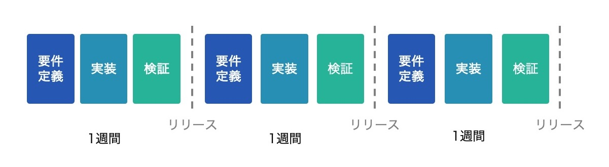

こんにちは、Autify CEOの近澤（[@chikathreesix](https://twitter.com/chikathreesix)）です。

先日[会社の紹介資料](https://speakerdeck.com/autifyhq/autify-company-deck)を公開しました。大変嬉しいことに多くの反響を頂いているのですが、会社の紹介資料には自動化に賭ける僕の熱い想いは詰め込めきれませんでした。そこで、なぜ我々が今テスト自動化に取り組んでいるのか、なぜテスト自動化がこれからの社会において重要なのか、改めてブログにまとめました。

# テストの大半が未だに人手

ソフトウェアテストとは、開発したソフトウェアが正しく動作するか検証する作業のことです。ですのでソフトウェアを開発するあらゆる組織において、テストを実施する必要があります。市場は非常に大きく、**IT予算の1/3をテストに使っている**と言われ、その額は**130兆円**にも登ります。

この作業ですが、未だにグローバルで見てもおよそ**75%の企業が人手に大きく依存しています。**人手のテストは当然人件費と時間が多くかかるわけですが、これまではそれほど大きな問題にはなりませんでした。しかし近年テスト自動化の必要性が急速に高まってきました。

# 急速な市場の変化

なぜテスト自動化の必要性が高まってきたのか、それを説明するには市場の変化から話をする必要があります。IT業界にいらっしゃる方であれば説明不要かと思いますが、近年の市場の変化のスピードがとても速くなってきました。

令和に差し掛かる手前で公開された、平成元年と平成30年の[世界の時価総額ランキングの変化](https://diamond.jp/articles/-/177641?page=2)では、平成元年でトップをほぼ独占していた日本企業が、平成30年にはアメリカや中国のIT企業によって塗り替えらた事実が浮き彫りになりました。

*データはダイアモンドの記事を参照*

なぜこのような事が起きたのでしょうか。背景にあるのは市場の急速な変化に素早く対応するソフトウェアの力があると考えます。現在の時価総額トップ企業の多くは、その事業の中核にソフトウェアが据えられています。

ソフトウェアの本質的な価値は、**市場のニーズに応じて素早く柔軟にかつ頻繁にその形を変えられること**にあります。[Software is eating the world](https://a16z.com/2011/08/20/why-software-is-eating-the-world/)と言われて久しいですが、多くの事業が凄まじい勢いでソフトウェアに代替され、なおかつ日々変化し続けています。

例えばiPhoneが市場に登場してから、10年程度で全く新しい巨大市場が生まれました。このような変化に素早く対応し、柔軟に変化し続ける企業が近年の競争に勝ち残れると言えるでしょう。

# ウォーターフォール開発の問題点

これまで多く使われてきた開発手法はウォーターフォール開発です。ウォーターフォール開発は簡単に説明すると、下記の図のように各フェーズにしっかりと時間をかけて段階的に進めます。各フェーズに数ヶ月ごとかけて、リリースまでに半年から一年、長いときは数年かける形です。

絶対にミスがあってはならないシステムの場合は、ウォーターフォール開発によって各フェーズごとにミスがないように確認を進めていく手法は相性が良いです。しかし変化の激しい市場に対してウォーターフォールでソフトウェアを開発していたら、一年間開発している間にユーザーのニーズは変わってしまい、**リリースする頃には誰からも求められない製品**になってしまうかもしれません。

# アジャイル開発の浸透

急速な変化に対応するには、ソフトウェアの開発に年単位の時間をかけることはできません。素早く開発を行うため、近年ではアジャイル開発が主流となり、この手法を採用するチームは９割を超えています。

アジャイル開発は、下記の図のように各フェーズを短く限り少しづつ早いサイクルでリリースしていく手法です。

これによりユーザーのニーズを受けすぐにそれを改善する、というような素早い改善サイクルを実現することが出来ます。

# サブスクリプションビジネスの台頭

さらにこのアジャイル開発の普及を近年後押ししている理由として、サブスクリプションビジネスの台頭が挙げられます。これまではソフトウェアの買い切りが主流でしたが、SaaS企業に代表されるように、月額や年額課金のサブスクリプション販売が主流となってきました。

分かりやすい例だとAdobeがあります。数年前までIllustratorなどは10万円くらいのパッケージを一回買い切り、一年に一回の大きなアップデートバージョンを購入するかどうか選択する形でした。しかし近年サブスクリプションに移行し、月額数千円から利用できるようになりました。

サブスクリプションの場合、**顧客側は少ない金額で始めることができ、使えなければ解約できる**というメリットを享受できます。逆に提供側は、顧客を満足させ続けなければ解約されてしまいます。しかし継続的に満足させ続ければ、**積み上げ型のビジネスとなり売り上げが安定化しつつ拡大していく**という大きなメリットを享受できます。

2013年頃にサブスクリプションに完全移行したAdobeの時価総額は、その後急上昇しました。

顧客を継続的に満足させるには、不満やニーズに対応して素早く製品を改善していくことが求められ、ウォーターフォールのように年単位の時間をかけるわけにはいかず、必然的にアジャイル開発となり、月数回、多いと週数回以上のアップデートが必要になってきます。

しかし単純に開発プロセスを短く区切るだけでは高速なリリースサイクルを実現することはできません。なぜなら**テストに時間がかかる**からです。

# アジャイル開発におけるテスト

アジャイル開発では機能を少しずつリリースするので、今回追加した機能の影響で既存機能が壊れてしまう可能性があります。そのためリリースする度に、リグレッションテストと呼ばれる既存機能のテストを行って、それらが壊れていないことを確認する必要があります。

そのためアジャイル開発では、テスト量がリリースを重ねる度に、理論上は線形的に増加することになります。しかし現実的には全てをテストするのはかなり難しく、テストが一部に留まるため、**テストできていなかった部分で障害が発生する**ということがよく起こります。

# テストの自動化が必須の時代へ

テストの範囲を広げて時間をかければ当然障害のリスクを減らすことはできますが、リリースサイクルを速めることができず、アジャイル開発が実現できません。しかしテストの範囲を広げなければ、テストできてない部分での障害が起こるリスクを抱え続けなければなりません。

つまり端的に言えば、人手のテストから脱却しなければ、**リリースサイクルを遅くするか、障害のリスクを抱えるか**の二択しかありません。リリースサイクルを遅くしたら競争力が下がりますし、障害のリスクを抱えたままでは、将来的に大きな損出をこうむる可能性があります。つまりこれらを解決するには**テストを自動化するしかないのです。**

**テスト自動化を行わなければ、市場の変化の波から取り残される**と言っても過言ではありません。

# あらゆる組織の競争力を高める

素早くリリースしていくことが事業自体の競争力の源泉になっているため、最近ではますますリリースサイクルが高速化してきています。[Netflixでは1日1,000回以上、Amazonでは11.7秒毎にデプロイしている](https://techbeacon.com/devops/10-companies-killing-it-devops)と言われています。

彼らがどのように高速なリリースサイクルを実現しているかというと、大量のテスト自動化エンジニアを採用して、あらゆるテストを自動化しているのです。しかしそのような大量採用が可能なのは世界でも指折り数えるトップテック企業のみです。

我々はそれをあらゆる組織で実現させるため、誰でも簡単にメンテナンスコストが低くテスト自動化ができるAutifyを開発しています。つまり本質的には、我々はテストを自動化しているのではなく、**「顧客の市場での競争力を上げるために、リリースサイクルを速めて、品質を上げる」**お手伝いをしているのです。

# 15年かけて見つけた人生を賭けられる領域

20歳くらいの頃から、いずれ起業して世界中の人に使われるものを作りたいと考えていました。そこに到達するため、20代は必要と思われるあらゆることに挑戦してきました。エンジニアとして技術を磨き、友人と起業して様々な人脈を培いつつも挫折して、シンガポールに渡り国際力を身に付け、最終的には念願だったサンフランシスコでのエンジニアとしての就職も叶えました。30歳になった時に必要なスキルは揃い、アイディアもある今しかないと思い、Autifyの前身となる会社をサンフランシスコの現地で設立しました。しかしその後２年ほど全く上手くいかず挫折の連続でしたが、最終的に[Burning needsを捉え、Autifyに辿り着きました。](https://chikathreesix.com/burning-needs)

*Alchemist AcceleratorのDemo dayで発表する様子*

僕のエンジニアというバックグランドを存分に生かし、巨大な市場で世界に通用する事業をようやく見つけることができました。20歳で想い描いていた世界に到達するのに15年かかり、35歳にしてようやくスタート地点に立てた感覚です。ここまで回り道もあったかもしれませんが、大きな目標に到達するため一歩ずつ山をしっかり登って来れたと思います。

SaaSスタートアップは$100MのARRに到達するのに10年程かかるとも言われますが、大きな目標を掲げてコツコツ積み上げていくのは、まさしく僕の人生そのものであり得意とするやり方です。toCサービスでドーンと跳ねて数年でExitみたいな世界は僕には合っていません。

Autifyは僕のこれまでのキャリアの集大成であり、人生そのものを反映しています。市場の大きさからもこの会社をユニコーンにすることは現実的に可能ですし、僕よりも優秀な仲間が多く集まり、必ず実現することができると確信しています。ですのでこの会社の買収オファーは不要です。我々の人生そのものを誰かに渡すことなんて今は全く考えられません。行けるところまで行ってみたい、目指すはアメリカでのIPOです。

15年前の僕は普通の大学の普通の大学生で、英語も全然できませんでした。あの頃の僕が、アメリカのトップアクセラレーターに入って、$2.5Mの資金調達をして、今のAutifyを作り上げることなんて全く想像できませんでした。でも、それを目指していました。今からは想像ができないような高い目標を掲げてコツコツ積み上げていく僕の人生を、これからのAutifyでも実現して行きたいと思います。そして**[一緒に実現してくれる仲間を募集中](https://autify.com/ja/careers)**です。

また15年後に答え合わせしましょう。
