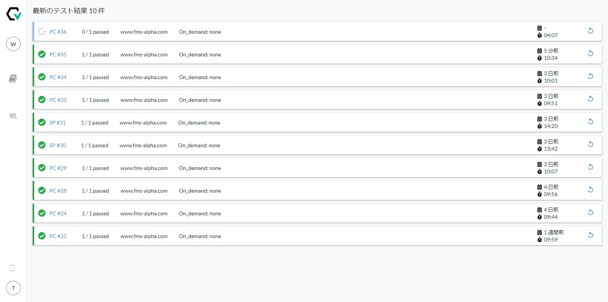
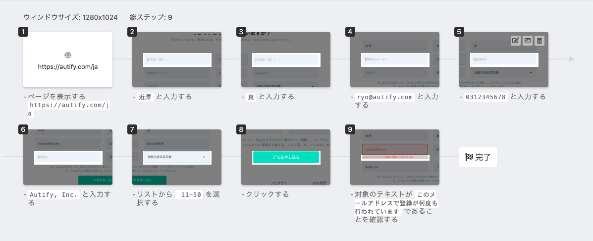
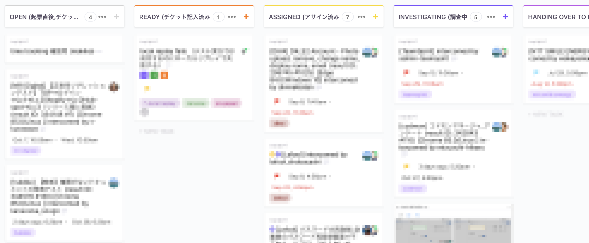

こんにちは、Autify CEOの近澤（[@chikathreesix](https://twitter.com/chikathreesix)）です。

早いもので2019年の10月初旬に正式リリースを行ってから1年が経ちました。1年前社員はまだ7名でしたが今や18名と組織は約**2.5**倍に拡大、MRR（月次収益）は約**6.3**倍になり、ご利用企業様はこの1年で世界各国より**200**社以上に拡大しました。

Autifyの成長は、ご愛用いただいているお客様、事業を支えて頂いている投資家の皆様のご支援のお陰です。本当にいつもありがとうございます。

順調な成長に見えますが、クローズドβからの期間も含めると1年半ほどの間に様々なアップダウンがありました。今回の記事では、今まで外には話して来なかったAutifyのこれまでの成長の裏話を詳しくご紹介します。

Autifyに辿り着くまでの軌跡は是非[「顧客のBurning needsを解決する」](https://chikathreesix.com/burning-needs)をご覧ください。

# 絶望的に機能が不足していたクローズドβ - 2019年3月

前述の記事の通りBurning needsを見つけ、2018年12月からAutifyの開発を本格化させました。リリース前から契約が取れ始めていたため、リリース日をコミットする必要があり、2019年の3月1日をβバージョンのリリース日としました。しかし実質開発期間は3ヶ月以下、開発エンジニアは２名以下の状態で実装できることはかなり限られていました。

よく、「最初のリリースが恥ずかしいものでないなら、リリースが遅すぎる」と言われます。DeNAの南場さんの話の中にも、最初に作ったオークションサイトのリリースでは出品機能がなかった、というものもあります。

Autifyのβローンチも多分に漏れず大変恥ずかしいものでした。なぜなら**自動テストを作る機能がなかった**からです。今ではRecorderと呼ばれている機能ですが、3月1日には存在せず、1ヶ月後の4月1日にこの機能がローンチされました。

*2019年3月ローンチ時点のAutify*

今だと笑っちゃうような話ですが、テストシナリオを作る機能がなくてどうやってテストするのか気になりますよね。当時は弊社がお客様からテストケースをいただいて、そのシナリオをRobot Frameworkというframeworkを使って社内で自動化コードを書いて、それをAutify上に乗せて動くようにしていました。 

全くスケールしない方法でしたが、この形でスタートできて非常に良かったと思っています。なぜならお客様からテストケースを頂いたことによって、どのようなテストを自動化したいのかよく理解できたからです。お客様のテストケースを分析することによって、Autifyに何の機能が優先的に必要なのか深く理解できました。

サービスの立ち上げ時には闇雲に機能を作ってなんでも自動化するのではなく、**スケールしない方法で顧客のニーズに向き合って解決していくことが非常に重要**であることが、身にしみて実感できました。

# クローズドβローンチ後の低迷 - 2019年3月 - 7月

2019年3月1日にクローズドβローンチを行い、その前後で[いくつかのメディアに取り上げていただきました](https://thebridge.jp/2019/02/japaneseenterpreneur-ai-softwaretest-autify-alchemistaccelerator)。そのお陰で全くマーケティング活動をしていないのにも関わらず、[8月の時点で150社を超えるデモリクエスト](https://initial.inc/articles/Vo1sB5mhGJF4FClESBw00)をいただきました。

しかしデモリクエストは数多くいただくものの、3月以降なかなか有償顧客が増えない状況がしばらく続きました。当時まだ社員が４人で営業とサポートは全部僕がやっている状況で、僕がちょうど資金調達に時間を割いていた為、人手不足でデモリクエストを適切に捌けていなかったなどの理由はありますが、今考えると単純に製品の成熟度が不足していたのだと思います。

そんな状況でも早期から有償契約を結んでいただいたお客様には本当に感謝しかありません。

# 正式ローンチ前から急成長 - 2019年8月 - 10月

しばらく低迷していたものの、8月ごろから急激に事業が伸びはじめます。MRRが前月比で倍以上になる事も何度かあり、**2019年7月から12月までのMRRのCMGR（月次平均成長率）は61.98%**でした。

10月に正式リリースした後からの引き合いも非常に大きかったのでそれも成長に大きく寄与しましたが、その前の8月から急成長が始まったので、何が起因になったのか正直よく分かりません。しかし、このくらいの時期からお客さんに**デモを見せたときに感動されることが増えてきた**ので、前述の通り製品がある成熟度のラインを超えたのではないかと思います。

製品の成熟度をあげた大きな機能の一つがシナリオ画面でのスクリーンショット表示だと思います。Autifyでシナリオを作成するとシナリオ画面でテストの操作が全て画像付きで表示されるのですが、これが2019年7月の後半にリリースされました。デモで感動してもらえるタイミングもこの画面を見せた瞬間が多いです。

# お問い合わせがパンク、既存顧客の満足度低下 - 2019年10月 - 12月

2019年10月に正式リリースを行い、[11月には本家TechCrunchにも掲載された](https://techcrunch.com/2019/10/16/autify-raises-2-5m-seed-round-for-its-no-code-software-testing-platform/)為、全世界から問い合わせが殺到し契約数もすごい勢いで増えた為、社内のオペレーションが完全にパンクしました。特にお客様からのお問い合わせ対応がパンクして死にそうだった為、Customer Success Engineerを急募していました。

<blockquote class="twitter-tweet">
Autify、ご導入企業様が凄い勢いで増えており、サポートの人手が早急に必要です。Customer Success Enginerを急募しております！エンジニアリング+顧客接点で興味ある方是非！！今、相当面白いフェーズだと思います。<a href="https://t.co/qkUVHqSEmS">https://t.co/qkUVHqSEmS</a>
&mdash; Ryo Chikazawa | Autify CEO (@chikathreesix) <a href="https://twitter.com/chikathreesix/status/1197023814510501888?ref_src=twsrc%5Etfw">November 20, 2019</a></blockquote>

このお問い合わせですが、作ったテストがなぜか動かないというものが、当時多く寄せられました。Autifyはあらゆるウェブサイトのテストをあらゆるブラウザで実行できるため、特定のフレームワーク、ライブラリ、ブラウザに依存する様々な問題が発生します。例えば、とあるお客様のテストがSafariでうまく実行できないという報告があり、調査をするとお客様のアプリケーションで使われている古いJavaScriptのライブラリが悪さをしていたり、[クロスブラウザでテキストフィールド内の値をクリアする](https://blog.autify.com/ja/clear-text)だけでも一苦労だったりします。

弊社ではクロスブラウザでのテスト実行は非常に大事だと考えているので、こういった様々な環境依存の問題を一つ一つひたすら泥臭いエンジニアリングで解決していますが、それぞれ解決に時間がかかるため、当時のAutifyはこのような環境依存の問題がまだ多くありました。

しかしその一方でこの頃はまだ足りない機能が山積みで、お客様からの機能リクエストも多く、とにかくどんどん新しい機能を出さなければならないというプレッシャーも感じていました。そのため会社全体での意識は新機能開発に向いていました。開発チームは新機能開発に注力しているため、テストが失敗した原因追及と解決の優先度が下がってしまっていました。

そのためお問い合わせいただいた問題が数ヶ月も放置されるような状態も発生し、問題解決の催促が来るようになってしまい、お客様の満足度が低下していく危機感を感じました。CSチームはこれらの催促の対応に追われるものの、開発チームは新機能開発で手一杯という状況で、この問題についてCSチームと開発チームの課題意識が全く異なっていたことに組織的な危機感を感じました。誰もが顧客のために全力を尽くしていたのですが、全く違う方向を見てしまっていました。

# 既存顧客第一を宣言 - 2020年1月

この事態を招いたのは、適切に組織の運営を設計することができなかった私の責任でした。なので全メンバーの前で、**既存顧客を第一に考える方針を明言**して、オペレーションの再構築を行いました。既存顧客を第一に考えるということは、新規顧客獲得のための対応や新機能開発の優先度を下げるということを意味しますが、このタイミングでしっかりと全社員が現在ご利用いただいているお客様の課題に向き合う必要があると考えました。

１番の問題となっている、お客様からのお問い合わせの解決までのリードタイムを短くするべく、各プロセスを分解してお問い合わせのチケットが今どのステージにいるのか分かりやすくしました。

またこのプロセスの中で、お問い合わせ頂いた問題の技術調査がボトルネックとなっていることが分かりました。そこでこの技術調査を2名エンジニアの当番制として、毎日必ず誰かが対応出来る様にしました。

これらの対応によりお問い合わせ対応のプロセスが大きく改善され、解決までのリードタイムも短くなりました。ただそれ以上に**全メンバーの意識が、既存顧客の成功を第一に考えることに向いた**ことが一番大きな変化でした。

# COVID-19の感染拡大 - 2020年2月 -

皆さんも同様だと思いますが、COVID-19の感染拡大から様々な変化が起こりました。弊社では2月の中旬ごろからリモート体制へ移行し、リモートワークが上手くいったため、今ではオフィスも解約してフルリモート勤務になりました。お客様とのミーティングもこれ移行全てオンラインになりました。COVID-19感染拡大の前には全く想像していなかった働き方になりました。

COVID-19の感染による事業への影響は、結果的には全くありませんでした。社会全体として先行きが不透明ではありましたが、弊社においてはこれまでうまく事業が伸びていたため、前回の調達資金を殆ど使っておらず、３年以上のランウェイが確保されていたため大きな心配はありませんでした。

しかし社会全体の不安感から、新しいことは一旦やめておこうという動きがお客様の中で広がり、3月あたりに新規契約の動きが悪くなりました。そこで[4月から１ヶ月の無料トライアルキャンペーンを始めました](https://autify.com/ja/news/2020/04/14/freetrial)。これまでは社内で対応できるリソースが確保できるか懸念があったため、広く一般的に無料トライアルはやっていませんでしたが、新規でご検討いただいている方々のハードルを下げるべく実施することにしました。これにより当然4月の新規顧客は殆どなくなってしまいましたが、5月からは堅調な成長が戻り、[正式ローンチ半年で導入累計100社を突破](https://autify.com/ja/news/autify-100-customers)することもできました。

# Autifyの進化はまだまだこれから

その後8月には累計導入200社を突破し、大変嬉しい事に数多くの方々にご愛用いただき、著名サービスの裏側でAutifyが使われている事例も増えてきました。これまで順調に成長してきましたが、Autifyの進化はまだまだ始まったばかりです。[長期的なロードマップの中に3つのフェーズ](https://speakerdeck.com/autifyhq/autify-company-deck?slide=18)を定義していますが、現在はまだフェーズ１の最初の段階に過ぎません。

<blockquote class="twitter-tweet">
Autifyを使い始めてみたんだけど、いや、これ、すごいな。僕が2日間くらいかけて書いたSeleniumコードで実現したテストシナリオ、数分でできてしまった。実行環境整える必要もないし、エビデンスは画像で残る。これ使ってしまうと、もう手でコード書くの嫌になってしまう。 <a href="https://t.co/K9l3jXnDbd">https://t.co/K9l3jXnDbd</a>
&mdash; Yoichiro Tanaka (@yoichiro) <a href="https://twitter.com/yoichiro/status/1314069971832459265?ref_src=twsrc%5Etfw">October 8, 2020</a></blockquote>

また、テスト自動化市場もまだまだ黎明期ですので、市場を広げるためにまだまだ多くのことに取り組んで行く必要があります。

今後も皆様のソフトウェアのリリース速度と品質の向上に益々貢献できるよう努力してまいります。これからのAutifyの進化にも是非ご注目ください！

---

[デモリクエスト受付中](https://autify.com/ja/demo) & [一緒に進んで行ってくれる仲間募集中](https://autify.com/ja/careers)です！
