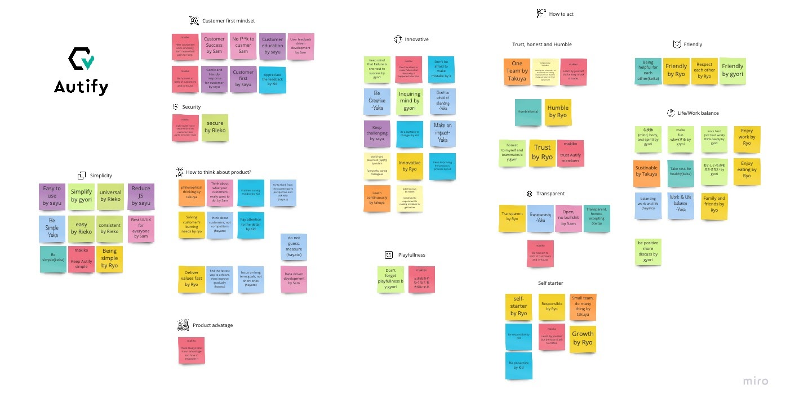
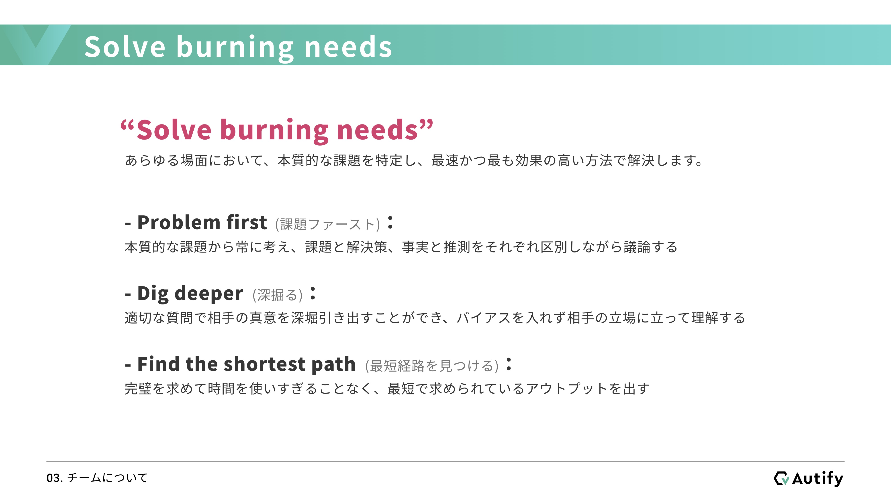
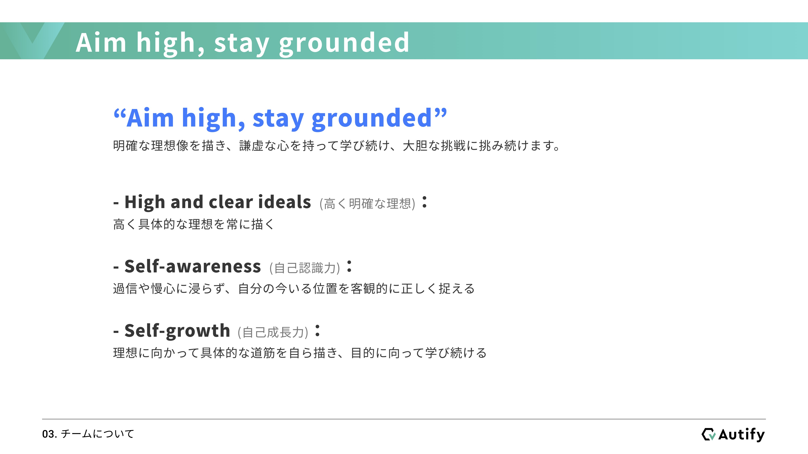
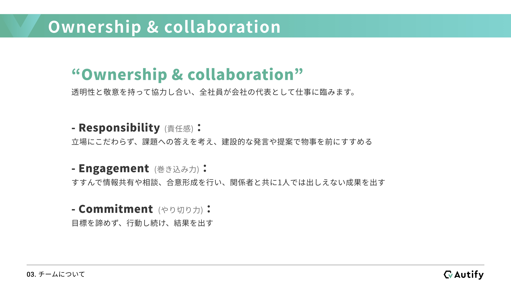
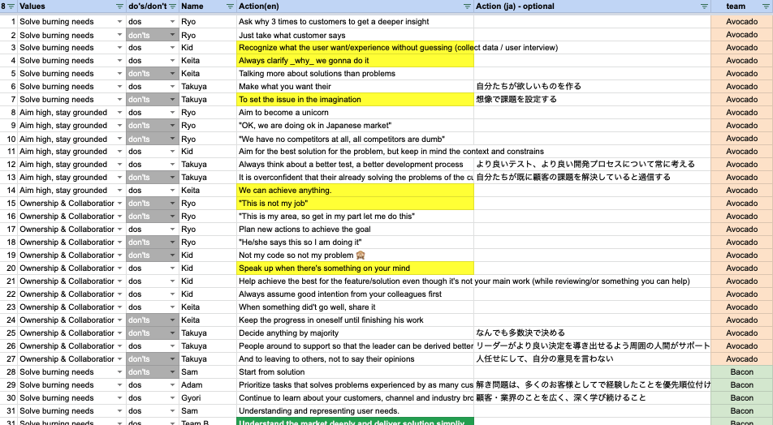

こんにちは、Autify CEOの近澤（[@chikathreesix](https://twitter.com/chikathreesix)）です。最近多くのスタートアップが、会社において大切にしている代表的な価値観を、バリューとしてまとめるようになってきました。バリューを策定して共有することは、その会社の企業文化を明文化することでもあります。

弊社でも、Autifyの開発を決め社名変更を行った2018年末に最初のバリューを策定し、2019年6月に改訂を行った後、2020年7月にバリューを現在の形に刷新しました。

今回の改訂は非常に良い形でまとまったため、バリューに対する想いなど詳しくお伝えしたいと思います。

# なぜバリューが必要なのか

なぜ、そもそも会社にバリューが必要なのでしょうか。正直、創業者しかいないフェーズでは不要だと思います。そんなことをしている暇があったら、[Burning needsを見つけましょう](https://chikathreesix.com/burning-needs)。

しかし会社が徐々に大きくなってくるとバリューの重要性が増してきます。我々もAutifyに至る前までは創業者のみで、とにかくうまくいく製品を作ることに必死でしたが、それで良かったと思います。ただ、Autifyに辿り着いてから一気に拡大するイメージが湧いたため、バリューを策定することにしました。

バリューという形にこだわる必要はないと思いますが、**企業文化を明文化するのは非常に重要です**。その理由は、大きく分けて二つあると考えています。

## 1. 採用の失敗をなくす

スタートアップにおいて「正しい採用無くして成功はあり得ない」と言えるほど「人」は重要です。**良い人の採用を見送ってしまうより、間違った人を採用する方が比較にならないほど悪い結果になります。**特に人数の少ない初期フェーズにおいて、一人のもたらす影響は非常に大きくなります。10,000人社員がいる中の1人が企業文化にもたらす影響は軽微でしょうが、5人の中の1人がもたらす影響は重大です。

以前、僕の師匠である[Chompの小林キヨさん](https://twitter.com/kiyokbys)に以下のようにアドバイスされたことがあります。

> スキルは代替できるが、カルチャーフィットは代替できない。絶対にスキルで採用してはいけない。

非常に優秀なエンジニア、ゴリゴリ売れるセールスなど、圧倒的なスキルを持っている人は世の中にいます。しかし、自社の文化に合わない人は絶対に採用するべきではありません。なぜなら、特にスタートアップの初期においては、組織の崩壊を招くからです。前述の通り一人のもたらす影響が大きいため、文化に合わない人を採用したせいで、他の優秀なメンバーが辞めてしまうこともあるでしょう。

我々も採用を加速させる前に、どういう人に来てもらいたいかメンバーの意識を合わせるためにバリューの策定を行いまいした。それから面接においてこのバリューへのフィットを測るための質問を作り、面接プロセスを再構築しました。このおかげでこれまで本当に素晴らしいメンバーに恵まれてきました。

## 2. メンバー全員が同じ方向を向く

メンバーが10人を超えてくると少なからず各メンバーの意識のズレが生まれてきます。議論がまとまらずあらぬ方向に白熱して行ってしまったり、メンバーから会社や製品がどういう形になっていくのか分からないといった声も聞くようになるでしょう。

また事業を進めていく中で、正解がない問題にも多く出会います。この二つの機能、どちらから作るべきか。割れた議論をどのように収拾させるのか。これらの問題は人によって答えが異なりますが、組織としては答えを統一する必要があります。バリューを定めることによって、難題にぶつかった時の行動指針を得ることができます。

組織に多様性はもちろん重要ですが、行動や根源となる考え方は揃えないと、全員がバラバラな方向を見てしまい、摩擦が増え、正しい行動もできなくなってしまいます。

# バリューの策定方法

バリューをどのように定めるかは人それぞれだと思いますが、Autifyではまず初めに社員全員でワークショップを行いました。バリューは各メンバーが自分ゴト化することが重要ですので、スタートアップの初期フェーズにおいては、全員参加型のワークショップが非常に良いと思います。ワークショップの流れは以下の通りです。

1. 15分くらいで各人が付箋に、Autifyで働く上で何が重要だと思うかを書き出します。
2. 一人3分くらいで順番に書き出した付箋の意図を発表していきます。
3. 発表を聞きながら、ファシリテーターが付箋を分類していきます。

その結果下記のようなボードができました。これにより各メンバーがAutifyにおいて何を重要と考えているのかがよくわかりました。

この結果を受けてボードメンバーで、どういう行動をするべきか、どういう行動をするべきでないかを洗い出し、バリューを文言に落とし込んで行きました。数回のミーティングの後下記3つのバリューが完成しました。

1. Solve burning needs - Burning needsを解決する
2. Aim high, stay grounded - 志は高く、腰は低く
3. Ownership & collaboration - オーナーシップとコラボレーション

その後、この3文だけだと解釈が多様になる可能性があると判断し、さらにもう一段階詳細化しました。次のセクションから各バリューを詳細に説明していきます。

# Solve burning needs

Burning needsの解決は[以前の記事でも書いた通り](https://chikathreesix.com/burning-needs)製品の開発初期において最も重要ですが、その後会社が成長していく段階においても大変重要だと考えています。例えば下記のような問題はどうやって答えを出すのが正しいでしょうか。

- 多くの機能リクエストが来る中で、何から開発するのか
- 人手が足りない中、どのポジションから採用するのか
- 新規顧客の獲得に注力するべきか、既存顧客の利用拡大に注力するべきか

Autify社内では課題が「どのくらい燃えている」かを常に意識しています。ですので何かに取り組む際は常に**課題ファースト（Problem first）**でなければなりません。必要そうだから人を採用しておこう、理想的にはこの機能が必要だから作っておこう、といった課題を前提としない行動は絶対にしてはいけません。

さらにそれらをなぜ課題たらしめているのかを**深掘る（Dig deeper）**ことも大変重要です。例えばお客様からの機能リクエストを、言われたままに作ることは絶対にやってはいけません。それが必要となった背景を深く理解することが重要です。対顧客における深掘り力は非常に重要ですが、同時に難しいスキルでもあります。どのようにこのスキルを磨いていくのかは、また別の記事で詳しく紹介します。

最後にBurning needsを見つけたら、それを解決する**最短経路を見つける（Find the shortest path）**ことが大事です。100%頑張って100%の成果が達成できるのは当たり前です。しかしリソースの限られているスタートアップにおいては、完璧にやり切るのではなく、50%やって、80%の成果を達成できるポイントを見つけることが重要だと考えています。Burning needsの中でも特に大きく燃えている箇所を、最小限の工数で解決します。

ちなみに、顧客の課題は燃えていることを確認してから対応する一方で、組織内の課題は実際に燃えてからだと遅い事が多いので、燃える少し手前くらいに手を打つのが正しいと考えています。ですので弊社では早い段階から、バリューの明確化、採用プロセスの構造化、給与テーブルと評価制度の設計などに取り組んできました。詳しくは[会社の紹介資料](https://speakerdeck.com/autifyhq/autify-company-deck)をご覧ください。

# Aim high, stay grounded

スタートアップである以上、成長し続け高みを目指す事がとても大事だと思います。口で言うのは簡単ですが、スタートアップと言えど数億〜十数億でどこかに買ってもらえればいいかな、と考えているところも多いと思います。僕もAutifyにたどりが着く前は、うまく行かなすぎてそう考えたこともありました。高みを目指した結果そうなるのは仕方がないですが、高い目標は目指さなければ到達することは絶対にあり得ません。

そのため、まず**高く明確な理想（High and clear ideals）**を描くことが重要だと考えています。理想が高すぎると最初は鼻で笑われることもあるかもしれません。僕も英語を勉強し始めた頃は、ネイティブと同じレベルで議論できるようになる目標を語ると「帰国子女でもないのに無理でしょ」みたいな反応がありました。しかし今ではできます。また高い理想は同時に明確でなければいけません。明確でないと「おれはいつかビッグになる」と言う具体性の欠ける、ただのホラ吹きになります。

高く明確な理想を立てて登る山を決めた次は、自分がその山のどの地点に現在位置しているのかしっかりと理解する**自己認識力（Self-awareness）**が重要です。自己評価が高すぎると、自分はもう出来てると思ってしまうので、その時点でそれ以上の成長が見込めません。優秀な人に謙虚な人が多いのはそういった理由だと思います。

例えば、エンジニアに対して「ご自身のJavaScriptのレベルは1 ~ 10のうちどれですか」と聞くと、躊躇いなく10と答える人がたまにいます。W3Cで仕様を書いている人や、JavaScriptのエンジンを実装している人ならわかりますが、そうでない人が10という場合間違いなく自己評価が高すぎるでしょう。10と言っている時点で、自らの伸び代を制限してしまっているとも言えます。

最後に目標を決めて現在位置が分かっても、実際に行動に移さなければ成長はしません。具体的な道筋を描き着実に成長していく**自己成長力（Self-growth）**も極めて重要です。やるべきことをしっかりとコツコツと積み上げ着実に成長していくことで、高い理想に到達することができます。SaaSスタートアップの成長は、まさしくこの地道な積み上げによって成されると考えています。

# Ownership & collaboration

大きな目標は一人では達成できません。これから社員が急増していく中で、チームと個人、両軸での働き方を定義する必要があると感じ、このバリューを作りました。「これは自分の仕事ではありません」や「これは自分の仕事なので邪魔しないでください」と言う人は今のAutifyにはいませんが、そのような意識をチームメンバーが持たないように、**オーナーシップとコラボレーション**を両立することが大事だと考えました。

まず複数人での業務を進めるには、責任の所在を明確にする必要があると考えます。ですので、各人が自分事化できる**責任感（Responsibility）**を持つことが重要です。自分の責任ではないと考えていると、無責任な意見になるし、建設的に物事が進まず、結局誰が決めるの？となって議論が空中分解しがちです。前職のDeNAでよく言われていた「最後の砦意識」を各人に持ってもらうことが大事だと考えています。

また、自分自身ですすんで周りを巻き込む、**巻き込み力（Engagement）**を発揮することも大切です。チームワークは勝手には生まれるものではなく、誰かの積極的な働きかけから始まります。組織が大きくなってくれば尚更連携が難しくなり、チームごとの分断が容易に発生してしまいます。ですので個々人が周りを巻き込む意識を持たないと、自分の事情を他人に押し付けて協力し合わない最悪なチームワークになってしまうと考えています。

最後に実際に責任感を持って巻き込んでも目標が達成できなければ意味がありません。立てた目標をやり切る、**やり切り力（Commitment）**が重要です。これがなければ仲良しグループで終わってしまいます。一人一人がプロフェッショナルとしての自覚を持ち、お互いを尊敬し協力しあって成果を出す組織であり続けます。

# バリューの浸透方法

バリューを作ったは良いけどそれだけで形骸化してしまうケースも多いと思います。きちんと各メンバーが自分のものとして捉えて行動に移していく形にしなければいけません。バリューの浸透を促す為に、各バリューに対するdos and don'tsを挙げるワークショップを全員で実施しましたが、これが想像以上にうまく行きました。

全体を４チームくらいに分けて、Spreadsheetを使って10分間くらいでそれぞれでdos and don'tsを挙げて、チーム内で共有、その後チームのリーダーが全体にまとめを共有するという形で実施しました。実施する前はどのくらい盛り上がるか全く検討が付かなかったのですが、結果的に非常に盛り上がりました。これによって各メンバーがバリューをより自分のモノと思ってもらえたのではないかと思います。

ワークショップで出来上がったSpreadsheet

# まとめ

今後の更なる成長に備え、全員が同じ方向を向き、継続的に目標を達成する強いチームの基盤を作りたく、これらのバリューを作りました。これらに沿った行動を評価し、これらに反する行動にNoと言える基盤ができました。

また、現時点のAutifyを表す、非常に良いバリューになったと思います。実際にAutifyでは「それって本当にBurning needsなの？」とか「その課題どのくらい燃えているの？」という会話が自然と出てきており、バリューがしっかりと自分たちの物になっていると実感しています。

来年はまた組織が倍以上になる予定なので、急速な成長の中でもバリューが形骸化せず、企業文化が崩壊しないようにしっかりと問題に向き合って一つ一つ対処していくことが大事だと感じています。

一緒にAutifyをさらに成長させていってくれる[仲間を募集](https://autify.com/ja/careers)しています！

# おまけ

バリューをまとめていく中で、Ben Horowitzの下記の本は大変参考になりました。企業文化とは何であるか、具体例を交えて非常に分かりやすくまとまっている良書です。まだお読みでない方は是非読んでみてください。

  <iframe style="width:120px;height:240px;" marginwidth="0" marginheight="0" scrolling="no" frameborder="0" src="https://rcm-fe.amazon-adsystem.com/e/cm?ref=qf_sp_asin_til&t=bluedemon01-22&m=amazon&o=9&p=8&l=as1&IS1=1&detail=1&asins=B086KX8LHZ&linkId=c6c07eec98b89ad0188a069200bd03d8&bc1=ffffff&lt1=_top&fc1=333333&lc1=0066c0&bg1=ffffff&f=ifr"></iframe>

